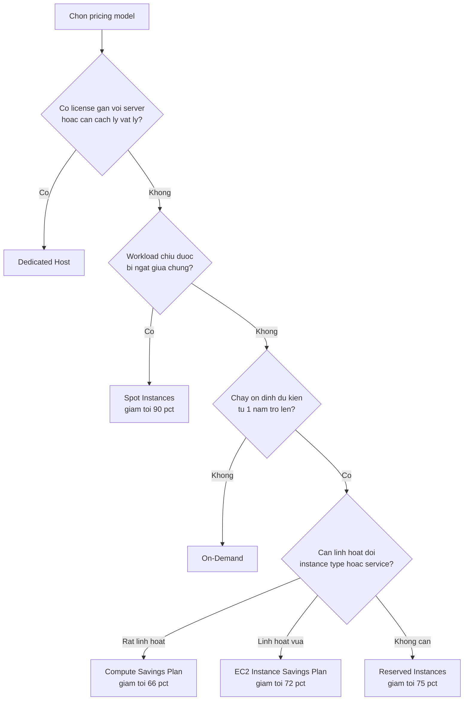
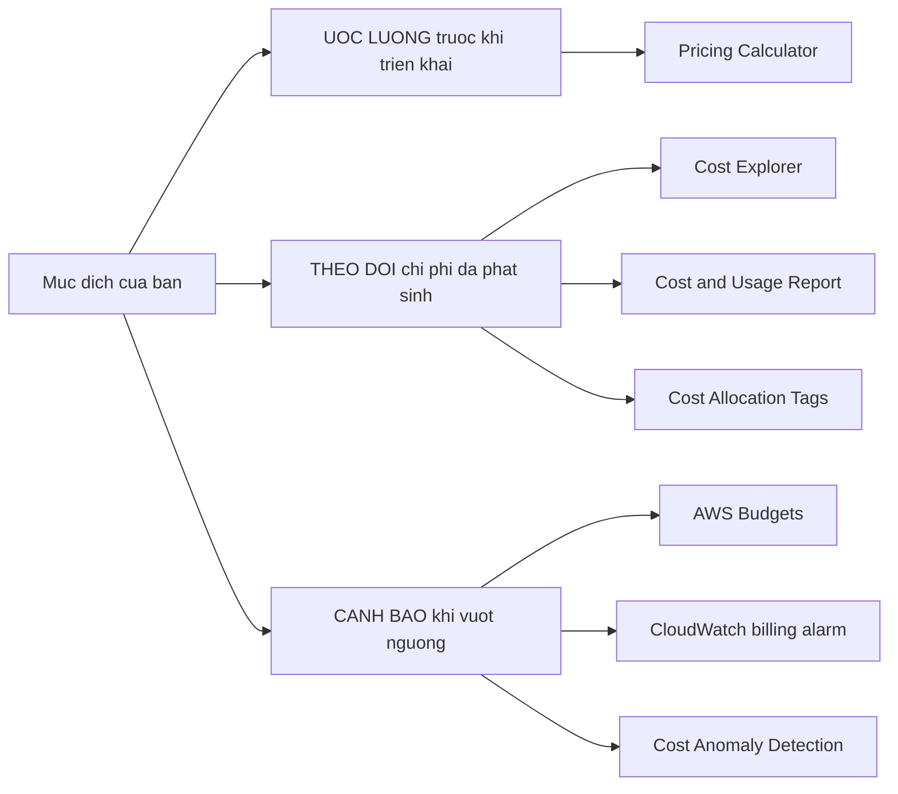

# Phase 4 — Billing, Pricing & Support (Domain 4 — 12%)

> **Thời gian học đề xuất:** ~1 giờ
> **Nguồn:** [sections/account_management_billing_support.md](https://github.com/kananinirav/AWS-Certified-Cloud-Practitioner-Notes/blob/master/sections/account_management_billing_support.md) + [sections/architecting_and_ecosystem.md](https://github.com/kananinirav/AWS-Certified-Cloud-Practitioner-Notes/blob/master/sections/architecting_and_ecosystem.md)
> **Sau khi học xong:** làm `02-practice-questions.md` (34 câu) → `03-gate-quiz.md` (15 câu, cần ≥12/15)

Domain 4 chỉ chiếm 12% (~6 câu tính điểm trên bài thi thật), nhưng đây là domain **dễ ăn điểm nhất** vì kiến thức thuần ghi nhớ, không có tình huống kiến trúc phức tạp. Mục tiêu của phase này là làm đúng gần như 100% Domain 4.

---

## Mục lục

1. [3 nguyên tắc định giá của AWS](#1--3-nguyên-tắc-định-giá-của-aws)
2. [Pricing models — so sánh & khi nào chọn cái nào](#2--pricing-models--so-sánh--khi-nào-chọn-cái-nào)
3. [Savings Plans](#3--savings-plans)
4. [Cách AWS tính tiền các service chính](#4--cách-aws-tính-tiền-các-service-chính)
5. [Bộ công cụ quản lý chi phí — phân biệt cho đúng](#5--bộ-công-cụ-quản-lý-chi-phí--phân-biệt-cho-đúng)
6. [Cost Allocation Tags](#6--cost-allocation-tags)
7. [Free Tier](#7--free-tier)
8. [AWS Organizations](#8--aws-organizations)
9. [Support Plans — bảng so sánh đầy đủ](#9--support-plans--bảng-so-sánh-đầy-đủ)
10. [Trusted Advisor](#10--trusted-advisor)
11. [Liên hệ ai khi có việc gì](#11--liên-hệ-ai-khi-có-việc-gì)
12. [AWS Ecosystem — tài nguyên & đối tác](#12--aws-ecosystem--tài-nguyên--đối-tác)
13. [Câu hỏi hay bẫy](#13--câu-hỏi-hay-bẫy)
14. [Checklist tự kiểm tra](#14--checklist-tự-kiểm-tra)

---

## 1 — 3 nguyên tắc định giá của AWS

Đề thi hay hỏi dạng "Which AWS pricing principle / Why does AWS pricing keep dropping?". Nhớ 3 nguyên tắc cốt lõi:

| Nguyên tắc | Tiếng Việt | Nghĩa là gì | Ví dụ |
|---|---|---|---|
| **Pay as you go** | Trả theo mức dùng | Không cam kết trước, không phí tối thiểu, dùng bao nhiêu trả bấy nhiêu | EC2 On-Demand tính theo giây, Lambda tính theo request |
| **Pay less when you reserve** | Trả ít hơn khi cam kết trước | Cam kết 1 hoặc 3 năm → giảm giá sâu | Reserved Instances (tới 75%), Savings Plans (tới 72%) |
| **Pay less as you use more** | Dùng càng nhiều, đơn giá càng rẻ | Giảm giá theo bậc khối lượng (volume-based / tiered discount) | S3 storage, data transfer OUT, CloudFront |

Ngoài ra tài liệu AWS còn nhắc nguyên tắc thứ tư: **"Pay less as AWS grows"** — AWS liên tục giảm giá nhờ **economies of scale** (kinh tế theo quy mô). Nếu câu hỏi là *"The continual reduction of AWS Cloud pricing is due to…"* → đáp án là **economies of scale**.

**Bẫy thường gặp:** "Pay as you go" ≠ "Pay less when you reserve". Nếu câu hỏi nói *linh hoạt, không cam kết* → pay as you go. Nếu nói *dự đoán được ngân sách, cam kết dài hạn* → reserve.

---

## 2 — Pricing models — so sánh & khi nào chọn cái nào

### Bảng so sánh tổng hợp

| Model | Mức giảm giá | Cam kết | Có thể bị ngắt? | Dùng khi nào |
|---|---|---|---|---|
| **On-Demand** | 0% (giá gốc) | Không | Không | Workload ngắn hạn, không đoán được, chạy 1 lần, **không được ngắt giữa chừng**; dev/test; lần đầu chạy để đo tải |
| **Reserved Instances (RI)** | Tới **75%** | 1 hoặc 3 năm | Không | Workload **ổn định, chạy liên tục, dự đoán được** (DB production, web server 24/7) |
| **Spot Instances** | Tới **90%** | Không | **CÓ** (AWS thu hồi, báo trước 2 phút) | Workload **chịu được ngắt**: batch, xử lý ảnh/video, big data, CI/CD, phân tích dữ liệu, job có thời gian bắt đầu/kết thúc linh hoạt |
| **Savings Plans** | Tới **72%** | 1 hoặc 3 năm (cam kết **$/giờ**) | Không | Muốn giảm giá như RI nhưng cần **linh hoạt hơn** về instance type / service |
| **Dedicated Host** | On-Demand hoặc Reservation 1–3 năm | Tuỳ chọn | Không | **BYOL** (license gắn với server/socket/core), yêu cầu **cách ly vật lý** (physical isolation), tuân thủ compliance |

### Reserved Instances — chi tiết cần nhớ

**Standard RI vs Convertible RI:**

| | **Standard RI** | **Convertible RI** |
|---|---|---|
| Mức giảm giá | Cao hơn (tới ~72–75%) | Thấp hơn (tới ~54–66%) |
| Đổi instance family / OS / tenancy | **KHÔNG** được đổi | **ĐƯỢC** đổi, miễn là RI mới có **giá trị bằng hoặc lớn hơn** (equal or greater value) |
| Đổi AZ / instance size (trong cùng family) / network type | Được (modify) | Được |
| Bán lại trên **RI Marketplace** | **ĐƯỢC** bán | **KHÔNG** được bán |

> Câu hỏi kinh điển: *"…can change the attributes of the RI as long as the exchange results in the creation of RIs of equal or greater value"* → **Convertible RI**.
> Và: *"workload có thể thay đổi trong thời gian reservation, muốn đổi sang RI có computing power cao hơn"* → **Convertible RI**.

**Thời hạn & cách trả tiền (payment options):**

| Payment option | Trả tiền thế nào | Mức giảm giá |
|---|---|---|
| **All Upfront** | Trả hết 100% ngay từ đầu | **Cao nhất** |
| **Partial Upfront** | Trả một phần trước + phần còn lại theo giờ | Ở giữa |
| **No Upfront** | Không trả trước, trả đều theo giờ | **Thấp nhất** |

Kết hợp với thời hạn:

```
Giảm giá tăng dần:
1 năm, No Upfront, Convertible   →  ít nhất
1 năm, All Upfront, Standard
3 năm, No Upfront, Convertible
3 năm, All Upfront, Standard     →  NHIỀU NHẤT
```

> **Ghi nhớ:** *thời hạn dài nhất (3 năm) + trả trước hết (All Upfront) + loại cứng nhắc nhất (Standard)* = **giảm giá nhiều nhất**. Đây là câu gần như chắc chắn xuất hiện.

RI không chỉ có cho EC2. Còn có: **RDS Reserved Instances, DynamoDB Reserved Capacity, ElastiCache Reserved Nodes, Redshift Reserved Nodes**.

### Dedicated Host vs Dedicated Instance — đừng lẫn

| | **Dedicated Host** | **Dedicated Instance** |
|---|---|---|
| Cách ly vật lý | Có — bạn thuê **cả server vật lý** | Có — chạy trên hardware riêng |
| Thấy & kiểm soát socket/core | **CÓ** | Không |
| **BYOL** (license theo socket/core, server-bound) | **ĐƯỢC** | Không |
| Instance luôn chạy trên cùng host | Có | Không đảm bảo (có thể chuyển host sau khi stop/start) |

> Câu hỏi có các từ khoá **"existing server-bound software license"**, **"per-core software license"**, **"BYOL"**, **"physical isolation"** → đáp án luôn là **Dedicated Hosts**.

### Cây quyết định "chọn pricing model nào"



Từ khoá nhận diện nhanh trong đề:

| Từ khoá trong câu hỏi | Đáp án |
|---|---|
| "for only one day", "without interruption", "runs only when needed yet must remain active" | **On-Demand** |
| "interruptible", "flexible start and end times", "not time-critical", "batch", "consistent uptime is not an issue" | **Spot** |
| "three-year time frame", "non-interruptible", "steady state", "predictable usage" | **Reserved Instances** |
| "server-bound license", "per-core license", "physical isolation" | **Dedicated Hosts** |
| "adjusts based on supply and demand" | **Spot** |
| "up to 90% discount" | **Spot** |
| "commit to a consistent amount of usage measured in $/hour" | **Savings Plans** |

---

## 3 — Savings Plans

Cam kết một số **tiền $/giờ** trong **1 hoặc 3 năm** (khác RI: RI cam kết theo *instance*). Đây là cách đơn giản nhất để cam kết dài hạn trên AWS.

| Loại | Mức giảm giá | Linh hoạt tới đâu | Áp dụng cho |
|---|---|---|---|
| **EC2 Instance Savings Plan** | Tới **72%** | Cam kết **một instance family trong một Region** (ví dụ C5 ở us-east-1); tự do đổi AZ, size (m5.xlarge → m5.4xlarge), OS (Linux/Windows), tenancy | Chỉ EC2 |
| **Compute Savings Plan** | Tới **66%** | Linh hoạt **nhất**: tự do đổi family, Region, size, OS, tenancy, và cả compute option | **EC2, Fargate, Lambda** |

- Payment options giống RI: **All Upfront / Partial Upfront / No Upfront**.
- Thiết lập & xem đề xuất từ **AWS Cost Explorer console**.

> **Nhớ ngược nhau:** linh hoạt **nhiều** hơn (Compute) → giảm giá **ít** hơn (66%). Linh hoạt **ít** hơn (EC2 Instance) → giảm giá **nhiều** hơn (72%).

---

## 4 — Cách AWS tính tiền các service chính

Đề CLF-C02 không hỏi con số cụ thể, chỉ hỏi **tính theo chiều nào**.

| Service | Tính tiền theo |
|---|---|
| **EC2** | Số instance, cấu hình (Region, OS, type, size), thời gian chạy (On-Demand: tối thiểu **60 giây**, sau đó **tính theo giây** với Linux/Windows), detailed monitoring |
| **Lambda** | **Số lần gọi (requests)** + **thời gian thực thi (duration)** × bộ nhớ cấp phát |
| **ECS – EC2 launch type** | Không phụ phí ECS; trả cho các AWS resource dùng (EC2, EBS…) |
| **Fargate** | Trả cho **vCPU và memory** cấp phát cho container |
| **S3** | Storage class, số lượng & kích thước object (**tiered theo volume**), số & loại request, **data transfer OUT**, Transfer Acceleration, lifecycle transitions |
| **EBS** | Volume type, GB/tháng **provisioned** (không phải dùng thật), IOPS (gp: included; io: provisioned), snapshots (GB/tháng), data transfer |
| **RDS** | Theo giờ; engine/size/memory class; On-Demand hoặc RI; storage thêm (GB/tháng); số I/O request; **Single-AZ vs Multi-AZ**; **backup storage miễn phí tới 100% dung lượng DB** |
| **CloudFront** | Khác nhau theo **khu vực địa lý**, tổng hợp theo edge location; Data Transfer Out (volume discount) + số request HTTP/HTTPS |
| **Networking** | **Inbound (vào AWS) luôn MIỄN PHÍ**. Outbound có phí và **tiered giảm giá theo volume**. Dùng **Private IP** thay Public IP để tiết kiệm; traffic **trong cùng AZ miễn phí** (nhưng đánh đổi tính sẵn sàng) |

> **Bẫy hay ra:** *"Inbound data transfer is free, outbound is charged"* — luôn đúng. Và **EBS tính theo dung lượng provisioned**, không phải dung lượng bạn thực sự ghi.

---

## 5 — Bộ công cụ quản lý chi phí — phân biệt cho đúng

Đây là phần **bị hỏi nhiều nhất và bẫy nhiều nhất** của Domain 4. Cách phân biệt: hỏi bản thân *"câu hỏi đang muốn ƯỚC LƯỢNG trước, THEO DÕI hiện tại, hay CẢNH BÁO khi vượt?"*



### Bảng phân biệt chi tiết

| Công cụ | DÙNG ĐỂ LÀM GÌ | Điểm nhận dạng riêng | Từ khoá trong đề |
|---|---|---|---|
| **AWS Pricing Calculator** | **Ước lượng chi phí TRƯỚC khi triển khai** — chưa có dữ liệu thật, chỉ mô phỏng kiến trúc | Hướng về **tương lai**, không cần dữ liệu account | "estimate the cost", "before deploying", "planning a new solution", "projected usage" |
| **AWS Cost Explorer** | **Trực quan hoá, phân tích chi phí & usage ĐÃ phát sinh** theo thời gian; **dự báo (forecast) tới 12 tháng** dựa trên usage quá khứ; đề xuất Savings Plan / RI tối ưu | Có biểu đồ, filter, granularity **monthly / daily / hourly / resource-level**; **chỗ duy nhất để forecast từ dữ liệu thật** | "visualize", "view the distribution of spending", "analyze cost over time", "forecast AWS spending", "break down costs by day, service, linked account" |
| **AWS Cost & Usage Report (CUR)** | **Bộ dữ liệu billing THÔ, đầy đủ và CHI TIẾT NHẤT** — line item theo **giờ hoặc ngày** cho từng service, kèm metadata về pricing & reservation, kèm tag đã activate | Xuất ra **S3**, query bằng **Athena / Redshift / QuickSight**. **"MOST granular / most comprehensive"** = CUR | "most granular data", "most comprehensive", "hourly line items", "dive deeper", "billing activity for the past month" |
| **AWS Budgets** | **Đặt ngưỡng và được CẢNH BÁO** khi chi phí/usage vượt (hoặc **dự báo sẽ vượt**) | **3 loại budget: Usage, Cost, Reservation**. Theo dõi RI utilization (EC2, ElastiCache, RDS, Redshift). Tối đa **5 SNS notification / budget**. **2 budget đầu miễn phí**, sau đó $0.02/ngày/budget. Filter giống Cost Explorer | "set custom cost and usage limits", "alert when threshold exceeded", "receive notifications if current or forecasted usage exceeds" |
| **CloudWatch billing alarm** | **Alarm ĐƠN GIẢN** trên chi phí, thường ghép với **SNS** để gửi email | Metric billing chỉ lưu ở **us-east-1**; là **chi phí THỰC TẾ (actual)**, **KHÔNG phải dự báo**; là tổng chi phí **toàn cầu**; **yếu hơn AWS Budgets** | "create a billing alarm", "trigger an SNS notification when threshold exceeded" |
| **AWS Cost Anomaly Detection** | **Tự động phát hiện chi tiêu bất thường bằng Machine Learning** | **KHÔNG cần tự định nghĩa ngưỡng** — nó học pattern chi tiêu lịch sử của bạn; gửi report kèm **root-cause analysis**; alert riêng lẻ hoặc tổng hợp daily/weekly qua SNS | "unusual spend", "detect cost spike", "without defining thresholds", "machine learning" |
| **AWS Compute Optimizer** | **Đề xuất cấu hình resource tối ưu** (rightsizing) dựa trên ML phân tích metric CloudWatch | Hỗ trợ **EC2, EC2 Auto Scaling Groups, EBS volumes, Lambda**; giảm chi phí tới **25%**; export ra S3 | "over/under provisioned", "right-size", "optimal AWS resources" |
| **Billing Dashboard** | Tổng quan cấp cao + **theo dõi Free Tier** | Nơi xem nhanh hoá đơn tháng này | "high level overview", "free tier dashboard" |
| **AWS Service Quotas** | Thông báo khi **gần đạt giới hạn service** (không phải chi phí) | Tạo CloudWatch Alarm từ console Service Quotas; xin tăng quota | "close to a service quota threshold", "Lambda concurrent executions" |
| **AWS Trusted Advisor** | **Kiểm tra & khuyến nghị** trên 5 hạng mục, trong đó có **Cost optimization** và **Performance** | Không cần cài gì; xem chi tiết ở [mục 10](#10--trusted-advisor) | "inspects AWS environment to find opportunities to save money AND improve performance", "monitor service limits" |

### Hai công cụ "cũ" vẫn xuất hiện trong đề

Nhiều practice exam được viết trước 2020 nên còn nhắc:

| Tên cũ trong đề | Thực tế hiện nay | Trong đề nó nghĩa là |
|---|---|---|
| **AWS Simple Monthly Calculator** | Đã bị thay bởi **AWS Pricing Calculator** | **Ước lượng hoá đơn tháng dựa trên usage dự kiến** → dùng để *forecast chi phí cho ứng dụng mới chưa chạy* |
| **AWS TCO Calculator** (Total Cost of Ownership) | Đã ngừng, chức năng gộp vào Pricing Calculator | **So sánh chi phí AWS với on-premises** để thấy mức tiết kiệm |

> Khi thi thật (CLF-C02) hãy chọn **AWS Pricing Calculator**. Nhưng khi làm practice exam trong repo này, nếu đáp án chỉ có "Simple Monthly Calculator" / "TCO Calculator" thì đó là đáp án đúng theo đề.

### TCO — chi phí nào được tính vào?

Khi so sánh TCO của AWS với on-premises, **chỉ tính các chi phí hạ tầng mà cloud thay thế được**:

**ĐƯỢC tính:** server vật lý, storage hardware, network hardware, **điện & làm mát (power/cooling)**, **an ninh vật lý của data center**, chi phí thuê mặt bằng, chi phí nhân công vận hành/thay thế server cũ, license OS/hypervisor.

**KHÔNG tính:** chi phí **phát triển software**, **project management**, license antivirus / application, chi phí đào tạo nhân sự, marketing — vì các chi phí này **giữ nguyên** dù bạn ở cloud hay on-premises.

> Bẫy: đáp án "Software development", "Project management", "Antivirus software licensing" gần như luôn **SAI** trong câu hỏi TCO.

### CapEx vs OpEx

| | **CapEx** (Capital Expenditure) | **OpEx** (Operational Expenditure) |
|---|---|---|
| Là gì | Chi phí đầu tư tài sản **trả trước một lần** | Chi phí vận hành **biến đổi theo mức dùng** |
| Ở đâu | On-premises: mua server, xây data center | Cloud: trả theo giờ/giây dùng thật |

Chuyển lên cloud = **chuyển từ upfront CapEx sang variable OpEx**. So với data center truyền thống, AWS có **variable cost thấp hơn VÀ upfront cost thấp hơn** (cả hai đều thấp hơn — đây là bẫy hay gặp, đừng chọn đáp án chỉ đúng một nửa).

---

## 6 — Cost Allocation Tags

Cách **theo dõi & phân loại chi phí ở mức chi tiết** (theo phòng ban, project, môi trường…).

| Loại tag | Prefix | Ai tạo |
|---|---|---|
| **AWS-generated tags** | `aws:` (ví dụ `aws:createdBy`) | AWS tự gắn khi tạo resource |
| **User-defined tags** | `user:` | Bạn tự định nghĩa (Name, Environment, Team, CostCenter…) |

Điểm cần nhớ:
- Phải **activate tag trong Billing console** trước khi nó xuất hiện trong báo cáo chi phí — tag chỉ có tác dụng **từ lúc activate trở đi**, **không hồi tố**.
- Tag có thể gắn cho EC2 instance/AMI/ELB/security group, RDS, VPC, Route 53, IAM user… Resource do **CloudFormation** tạo đều được tag giống nhau.
- Tag dùng để tạo **Resource Groups** (tập hợp resource chia sẻ tag chung), quản lý bằng **Tag Editor**.

> **Câu hỏi kinh điển:** *"track and categorize spending on a detailed level"* → **Cost allocation tags** (không phải Consolidated billing, không phải AWS Budgets).

---

## 7 — Free Tier

AWS Free Tier có **3 dạng**:

| Dạng | Nghĩa | Ví dụ |
|---|---|---|
| **Always Free** | Miễn phí vĩnh viễn, trong hạn mức | Lambda **1 triệu request/tháng**, DynamoDB **25 GB** storage, CloudWatch 10 custom metrics |
| **12 Months Free** | Miễn phí 12 tháng đầu kể từ khi tạo account | EC2 **t2.micro/t3.micro 750 giờ/tháng**, S3 **5 GB**, RDS 750 giờ db.t2.micro |
| **Trials** | Dùng thử ngắn hạn kể từ khi kích hoạt service | Amazon Inspector, SageMaker, Redshift (2 tháng) |

- Theo dõi mức dùng Free Tier ở **Billing Dashboard**.
- **Bẫy:** trong AWS Organizations, cả tổ chức được coi như **MỘT account** cho mục đích Free Tier — gộp 5 account **không** cho bạn 5 lần Free Tier.

---

## 8 — AWS Organizations

Service **global** để quản lý **nhiều AWS account**. Account chính gọi là **management account** (tên cũ: master/payer account).

### Lợi ích về chi phí (hay ra thi nhất)

| Lợi ích | Chi tiết |
|---|---|
| **Consolidated Billing** | **MỘT hoá đơn** cho toàn bộ account trong Organization, **một phương thức thanh toán** |
| **Volume discounts** | **Gộp usage của tất cả account** lại để đạt bậc giảm giá theo khối lượng (EC2, S3, data transfer…) — account nhỏ cũng được hưởng giá của "khách hàng lớn" |
| **Chia sẻ RI & Savings Plans** | RI và Savings Plan mua ở **một account** có thể áp dụng lợi ích cho **các account khác** trong Organization (pooling). Management account **có thể TẮT** việc chia sẻ RI discount cho bất kỳ account nào, **kể cả chính nó** |

### Lợi ích quản trị

- **API tự động tạo AWS account** mới.
- **Service Control Policies (SCP)** để giới hạn quyền của account.
- Tổ chức account theo **Organizational Units (OU)**.

### Service Control Policies (SCP)

- **Whitelist hoặc blacklist các IAM action**; áp dụng ở cấp **OU hoặc Account**.
- **KHÔNG áp dụng cho Management Account** ← bẫy rất hay ra.
- Áp dụng cho **mọi User và Role của account, kể cả Root user**.
- **KHÔNG ảnh hưởng service-linked roles**.
- SCP **không cho phép gì theo mặc định** — phải có **explicit Allow**.
- Use case: chặn dùng service nào đó (ví dụ không cho dùng EMR), enforce PCI compliance bằng cách disable service.

> SCP là **guardrail**, nó **giới hạn quyền tối đa** — nó không tự cấp quyền. Muốn user làm được việc thì vẫn cần IAM policy cho phép **VÀ** SCP không chặn.

### Multi-account strategy

Tách account theo: **department**, **cost center**, **dev / test / prod**, yêu cầu pháp lý (dùng SCP), cách ly resource tốt hơn (VPC), có **service limit riêng cho từng account**, account riêng cho logging. Dùng **tagging standard** cho mục đích billing; bật **CloudTrail ở mọi account** và gửi log về S3 tập trung.

### AWS Control Tower

Cách **dễ nhất để set up & govern môi trường multi-account** an toàn, tuân thủ best practice.

- Tự động hoá set up môi trường **chỉ với vài click**.
- Quản lý policy liên tục bằng **guardrails**; **phát hiện và tự sửa (remediate) vi phạm policy**.
- Theo dõi compliance qua **dashboard tương tác**.
- **Control Tower chạy TRÊN AWS Organizations** — nó tự động set up Organizations và triển khai SCP.

> Phân biệt: **Organizations** = công cụ nền để quản lý nhiều account + gộp hoá đơn. **Control Tower** = lớp tự động hoá phía trên, dựng sẵn landing zone theo best practice. Câu hỏi có "automate and manage secure, **well-architected**, multi-account environment" → **Control Tower**.

### Hai service liên quan hay bị lẫn

| Service | Làm gì |
|---|---|
| **AWS Resource Access Manager (RAM)** | **Chia sẻ resource bạn sở hữu** với account khác (trong hay ngoài Organization) để **tránh trùng lặp resource**. Hỗ trợ: Aurora, **VPC Subnets**, Transit Gateway, Route 53, EC2 Dedicated Hosts, License Manager |
| **AWS Service Catalog** | **Portal self-service** để user launch các "product" đã được admin **phê duyệt trước** (VM, database, storage…) → tránh user mới tạo stack không đúng chuẩn |

---

## 9 — Support Plans — bảng so sánh đầy đủ

### Bảng tổng hợp

| | **Basic** | **Developer** | **Business** | **Enterprise On-Ramp** | **Enterprise** |
|---|---|---|---|---|---|
| **Chi phí** | **Miễn phí** | từ **$29**/tháng | từ **$100**/tháng | từ **$5,500**/tháng | từ **$15,000**/tháng |
| **Dành cho** | Mọi account | Thử nghiệm / dev-test | **Production workloads** | Production hoặc **business-critical** | **Mission-critical** |
| **Kênh liên hệ kỹ thuật** | ❌ Không mở được support case kỹ thuật | **Email**, **giờ làm việc**, tới Cloud Support **Associates** | **24/7 phone + email + chat** tới Cloud Support **Engineers** | 24/7 phone + email + chat | 24/7 phone + email + chat, Senior Cloud Support Engineers |
| **Số case / contact** | — | **Unlimited cases / 1 primary contact** | **Unlimited cases / unlimited contacts** | Unlimited / unlimited | Unlimited / unlimited |
| **Customer Service (billing/account)** | ✅ 24×7 | ✅ | ✅ | ✅ | ✅ |
| **Trusted Advisor** | **7 core checks** | **7 core checks** | **FULL checks** + Support API + CloudWatch alarm on limits | Full checks | Full checks |
| **AWS Health Dashboard** | ✅ | ✅ | ✅ | ✅ | ✅ |
| **Technical Account Manager (TAM)** | ❌ | ❌ | ❌ | ✅ **pool** (nhóm) TAM | ✅ **designated** (chỉ định riêng) TAM |
| **Concierge Support Team** | ❌ | ❌ | ❌ | ✅ | ✅ |
| **Infrastructure Event Management (IEM)** | ❌ | ❌ | ⚠️ **Có phí thêm** | ✅ Bao gồm | ✅ Bao gồm |
| **Well-Architected & Operations Reviews** | ❌ | ❌ | ❌ | ✅ | ✅ |
| **Support API (programmatic access)** | ❌ | ❌ | ✅ | ✅ | ✅ |
| **Third-party software support** | ❌ | ❌ | ✅ | ✅ | ✅ |

### Response time theo mức nghiêm trọng (case severity)

| Severity | Developer | Business | Enterprise On-Ramp | Enterprise |
|---|---|---|---|---|
| **General guidance** | < **24 giờ làm việc** | < 24 giờ làm việc | < 24 giờ làm việc | < 24 giờ làm việc |
| **System impaired** | < **12 giờ làm việc** | < 12 giờ | < 12 giờ | < 12 giờ |
| **Production system impaired** | ❌ | < **4 giờ** | < 4 giờ | < 4 giờ |
| **Production system down** | ❌ | < **1 giờ** | < 1 giờ | < 1 giờ |
| **Business-critical system down** | ❌ | ❌ | < **30 phút** | < **15 phút** |

### Cách nhớ nhanh — trả lời câu "MINIMUM plan nào…"

| Câu hỏi "plan tối thiểu nào có…" | Đáp án |
|---|---|
| Mở được technical support case | **Developer** |
| **Hỗ trợ qua điện thoại (phone)** / chat | **Business** |
| **24/7** support | **Business** |
| Response time **1 giờ** (production down) | **Business** |
| Response time **4 giờ** (production impaired) | **Business** |
| **Full Trusted Advisor checks** | **Business** |
| **AWS Support API** (programmatic access) | **Business** |
| Unlimited **contacts** (không chỉ 1) | **Business** |
| **IEM không phải trả phí thêm** | **Enterprise On-Ramp** |
| **TAM** (dạng pool) | **Enterprise On-Ramp** |
| **Concierge** Support Team | **Enterprise On-Ramp** |
| **Well-Architected / Operations Review** | **Enterprise On-Ramp** |
| Business-critical down **< 30 phút** | **Enterprise On-Ramp** |
| **Designated (dedicated) TAM** | **Enterprise** |
| Business-critical down **< 15 phút** | **Enterprise** |

> **Cảnh báo về đề cũ:** Enterprise On-Ramp chỉ ra mắt năm 2021, nên nhiều practice exam cũ (Exam 1, 13–15) **chỉ có 4 plan**. Trong các đề đó, "TAM" / "Concierge" / "IEM" → đáp án là **Enterprise**. Khi thi CLF-C02 thật thì phải phân biệt On-Ramp (pool TAM, 30 phút) với Enterprise (designated TAM, 15 phút).

### Ba thứ chỉ Enterprise (On-Ramp) mới có — nhớ chức năng

| | Là gì | Dùng khi nào |
|---|---|---|
| **TAM** (Technical Account Manager) | **Đầu mối liên hệ chính (primary point of contact)** cho nhu cầu support liên tục; tư vấn kỹ thuật chủ động, review kiến trúc, chuẩn bị cho sự kiện lớn | Cần một người AWS hiểu hệ thống của bạn và đồng hành dài hạn |
| **Concierge Support Team** | Chuyên gia về **billing và account best practices** — giải đáp nhanh thắc mắc **không mang tính kỹ thuật** | Có câu hỏi về hoá đơn, thanh toán, cấu trúc account và muốn được trả lời nhanh, hiệu quả |
| **IEM** (Infrastructure Event Management) | AWS **đồng hành trong một sự kiện quy mô lớn**: launch sản phẩm, migration, flash sale — giúp planning, đánh giá kiến trúc, hỗ trợ realtime lúc diễn ra | Sắp có event tăng tải đột biến và cần AWS trực cùng |

---

## 10 — Trusted Advisor

Công cụ **đánh giá account ở mức cao, không cần cài gì**, đưa ra khuyến nghị trên **5 hạng mục**:

1. **Cost Optimization** (tối ưu chi phí)
2. **Performance** (hiệu năng)
3. **Security** (bảo mật)
4. **Fault Tolerance** (khả năng chịu lỗi)
5. **Service Limits** (giới hạn service)

> Câu hỏi hay hỏi *"Which of the following are categories of AWS Trusted Advisor? (Select TWO)"* — chọn đúng 2 trong 5 cái trên. Các đáp án bẫy: "Instance Usage", "Storage Capacity", "Infrastructure", "Auditing", "Scalability", "Serverless architecture" → **đều KHÔNG phải** category.

### Trusted Advisor theo Support Plan

| **Basic & Developer — 7 CORE CHECKS** | **Business, Enterprise On-Ramp & Enterprise — FULL CHECKS** |
|---|---|
| S3 Bucket Permissions | Full checks trên **cả 5 hạng mục** |
| Security Groups – Specific Ports Unrestricted | Đặt được **CloudWatch alarm khi gần đạt limit** |
| IAM Use (tối thiểu 1 IAM user) | **Programmatic access qua AWS Support API** |
| MFA on Root Account | |
| EBS Public Snapshots | |
| RDS Public Snapshots | |
| Service Limits | |

> Nhận diện: câu hỏi *"báo cáo tổng hợp trạng thái S3 bucket permissions + MFA on root + security group cho phép truy cập không giới hạn — xem ở đâu trong MỘT chỗ?"* → **Trusted Advisor report**. Và *"inspects AWS environment để tiết kiệm tiền VÀ cải thiện performance"* → **Trusted Advisor** (không phải Cost Explorer, vì Cost Explorer không nói gì về performance).

---

## 11 — Liên hệ ai khi có việc gì

Đây là nhóm câu hỏi rất hay bẫy. Bảng quyết định:

| Tình huống | Liên hệ | Cần support plan nào |
|---|---|---|
| **Resource AWS đang bị dùng cho mục đích xấu** (spam, port scanning, phát tán malware, DDoS, xâm phạm bản quyền) — của bạn hoặc nhắm vào bạn | **AWS Abuse Team** (`abuse@amazonaws.com`) | **Mọi plan, kể cả Basic** |
| **Câu hỏi về hoá đơn, thanh toán, account** (chung) | **AWS Customer Service** | **Mọi plan, kể cả Basic** (24×7) |
| **Cần hỗ trợ billing + kích hoạt lại account bị suspend** | Gửi **account and billing request tới AWS Support** | Mọi plan (billing case miễn phí) |
| **Muốn được tư vấn nhanh & hiệu quả về billing / account best practices** bởi chuyên gia riêng | **AWS Support Concierge** | **Enterprise On-Ramp / Enterprise** |
| **Đầu mối liên hệ chính cho nhu cầu support kỹ thuật liên tục**, tư vấn chủ động | **Technical Account Manager (TAM)** | **Enterprise On-Ramp / Enterprise** |
| **Lỗi kỹ thuật cụ thể** (ví dụ provision RDS xong không connect được) | **Mở support case với AWS Support** | **Developer** trở lên |
| **Chuẩn bị cho sự kiện tăng tải quy mô lớn** | **Infrastructure Event Management (IEM)** | Enterprise On-Ramp / Enterprise (Business: trả thêm phí) |
| **Cần AWS trực tiếp làm/đồng hành triển khai** (paid engagement, chuyên môn theo lĩnh vực) | **AWS Professional Services** | Không liên quan plan — **dịch vụ có phí** |
| **Không có chuyên môn AWS in-house, cần người thiết kế & build giúp** | **APN Consulting Partners** | Không liên quan plan |
| **Cần mua/thử software của bên thứ ba chạy trên AWS** | **AWS Marketplace** | Không liên quan plan |
| **Cần biết AWS event nào đang ảnh hưởng ĐẾN RESOURCE CỦA BẠN** | **AWS Health Dashboard** (Personal Health Dashboard) | Mọi plan |
| **Cần báo cáo compliance (SOC, ISO, PCI)** | **AWS Artifact** | Mọi plan |
| **Muốn đổi Support plan / đóng account** | Phải đăng nhập bằng **root user** | — |

### Hai dashboard hay bị lẫn

| | **AWS Personal Health Dashboard** (nay: *AWS Health Dashboard – Your account health*) | **AWS Service Health Dashboard** (nay: *Service health*) |
|---|---|---|
| Phạm vi | **CÁ NHÂN HOÁ** — chỉ event ảnh hưởng **resource của account bạn** | **CÔNG KHAI** — trạng thái chung của mọi AWS service theo Region |
| Cung cấp | Alert khi resource của bạn bị ảnh hưởng, **hướng dẫn khắc phục chi tiết (remediation guidance)**, thông báo chủ động về **scheduled activities** | Bảng trạng thái xanh/vàng/đỏ cho public |

> Từ khoá **"personalized"**, **"your resources"**, **"proactive notifications"**, **"events in progress"** → **Personal Health Dashboard**.

---

## 12 — AWS Ecosystem — tài nguyên & đối tác

### Tài nguyên MIỄN PHÍ

- **AWS Blogs**, **AWS Forums**, **AWS Whitepapers & Guides** — hoàn toàn miễn phí, ai cũng truy cập được.
- **AWS Quick Starts** — deployment tự động hoá theo "gold standard" (ví dụ WordPress on AWS, dùng CloudFormation).
- **AWS Solutions** — giải pháp đã được kiểm định (ví dụ AWS Landing Zone — môi trường multi-account an toàn).

> Câu hỏi *"Which security-related actions are available at NO COST?"* → **Accessing forums, blogs, and whitepapers**. Các đáp án bẫy: gọi AWS Support (cần plan trả phí), yêu cầu workshop từ Professional Services (có phí), học lớp ở đại học (có phí).

### Học có hướng dẫn (instructor-led)

- **AWS Classroom Training** và **AWS Online Tech Talks** = có giảng viên/chuyên gia dẫn.
- **AWS Blog / Forums / Trusted Advisor** = **không phải** instructor-led.

### AWS Partner Network (APN)

| Loại partner | Cung cấp gì | Chọn khi nào |
|---|---|---|
| **Consulting Partners** | **Dịch vụ chuyên môn** — tư vấn, thiết kế, build, migrate, quản lý (là con người / công ty dịch vụ) | Bạn **thiếu chuyên môn kỹ thuật AWS in-house** và cần người thiết kế/xây dựng workload |
| **Technology Partners** | **Sản phẩm / software** chạy trên hoặc tích hợp với AWS | Bạn cần một **sản phẩm phần mềm** |

**AWS Professional Services** = đội của **chính AWS**, hỗ trợ khách hàng **tăng tốc cloud adoption qua các paid engagement** trong nhiều lĩnh vực chuyên môn.

> Phân biệt: *"AWS team assists customers … through PAID engagements in specialty practice areas"* → **AWS Professional Services**. *"Customer không có chuyên môn in-house, cần chương trình nào của AWS"* → **APN Consulting Partners**.

### AWS Marketplace

- **Catalog số** với hàng nghìn software listing từ **independent software vendors (ISV)**.
- Gồm: **custom AMIs, CloudFormation templates, SaaS, containers**.
- **Chi phí mua đi vào chính hoá đơn AWS của bạn**.
- Bạn cũng **có thể tự bán** giải pháp của mình trên Marketplace.

> Từ khoá **"third-party software"**, **"independent software vendors"**, **"find, test, buy and deploy software that runs on AWS"**, **"try a third-party solution before deciding"** → **AWS Marketplace**.

---

## 13 — Câu hỏi hay bẫy

Đọc kỹ mục này ngay trước khi làm Gate Quiz.

### Nhóm 1 — Công cụ chi phí (bẫy nhiều nhất)

| Bẫy | Phân biệt đúng |
|---|---|
| **Cost Explorer** vs **Pricing Calculator** — cả hai đều "liên quan dự đoán" | Cost Explorer **forecast từ dữ liệu usage THẬT đã có** (tới 12 tháng). Pricing Calculator **ước lượng cho thứ CHƯA tồn tại**. Có account data → Cost Explorer. Đang lên kế hoạch → Pricing Calculator |
| **Cost Explorer** vs **Cost & Usage Report** | Hỏi **"MOST granular / MOST comprehensive"** → **CUR**. Hỏi **"visualize / analyze / forecast"** → **Cost Explorer** |
| **AWS Budgets** vs **CloudWatch billing alarm** | Cả hai đều cảnh báo. **Budgets mạnh hơn**: cảnh báo được cả trên **forecast**, có 3 loại (Usage/Cost/Reservation), filter chi tiết. **Billing alarm chỉ trên chi phí THỰC TẾ**, và metric chỉ ở **us-east-1**. Nếu đề hỏi "create a billing alarm" → **CloudWatch** |
| **Budgets** vs **Cost Anomaly Detection** | Budgets = **BẠN đặt ngưỡng**. Anomaly Detection = **ML tự học, KHÔNG cần ngưỡng** |
| **Trusted Advisor** vs **Cost Explorer** cho "tiết kiệm tiền" | Nếu câu hỏi nói tiết kiệm tiền **VÀ cải thiện performance** → **Trusted Advisor** (Cost Explorer không xét performance) |
| **Trusted Advisor** vs **Service Quotas** cho "monitor service limits" | Cả hai đều được; đề CLF hay lấy **Trusted Advisor** (có category Service Limits). Nếu đáp án có cả hai, ưu tiên theo ngữ cảnh câu hỏi |
| **Cost allocation tags** vs **Consolidated billing** | "Track & categorize spending **ở mức chi tiết**" → **tags**. "Gộp nhiều account thành một hoá đơn" → **consolidated billing** |
| **Compute Optimizer** vs **Trusted Advisor** | Compute Optimizer = **rightsizing bằng ML** cho EC2/ASG/EBS/Lambda. Trusted Advisor = check tổng quát 5 category |

### Nhóm 2 — Pricing models

| Bẫy | Phân biệt đúng |
|---|---|
| Spot "rẻ nhất" nên chọn bừa | Spot **có thể bị AWS thu hồi**. Nếu đề nói *"without interruption"*, *"mission-critical"*, *"SLA 99.999%"*, *"must not be stopped"* → **KHÔNG chọn Spot** |
| On-Demand vs Spot cho job ngắn | *"chạy 1 ngày, không được ngắt"* → **On-Demand**. *"job linh hoạt, ngắt được"* → **Spot** |
| Standard RI vs Convertible RI | Muốn **ĐỔI** attribute / instance type → **Convertible**. Muốn **giảm giá tối đa** → **Standard**. Muốn **BÁN LẠI** trên RI Marketplace → chỉ **Standard** |
| RI nào giảm nhiều nhất | **3-year + All Upfront + Standard**. Đừng chọn "3-year No Upfront Convertible" chỉ vì thấy chữ "3-year" |
| Dedicated Host vs Dedicated Instance | **License gắn với server / per-core / BYOL** → **Dedicated Host** (chỉ Host cho bạn thấy socket & core) |
| Savings Plans nào giảm nhiều hơn | **EC2 Instance SP (72%) > Compute SP (66%)** — càng linh hoạt càng giảm ít |
| EBS tính tiền theo dung lượng dùng | Sai — **EBS tính theo dung lượng PROVISIONED** |
| Data transfer | **Inbound MIỄN PHÍ**, outbound có phí (tiered). Dùng **Private IP** rẻ hơn Public IP |

### Nhóm 3 — Organizations & billing

| Bẫy | Phân biệt đúng |
|---|---|
| Consolidated billing có tự tăng service limit? | **KHÔNG**. Service limit là **theo từng account** |
| Consolidated billing có tự mở rộng support plan của management account cho các account con? | **KHÔNG**. Support plan là **theo từng account** |
| Consolidated billing có cho "giảm giá cố định x%"? | **KHÔNG**. Nó cho **volume discount** (giảm theo bậc khối lượng) + chia sẻ RI/SP |
| RI mua ở account con thì ai được lợi? | **Tất cả account** trong Organization đều có thể nhận hourly cost benefit (nếu chưa tắt RI sharing) — **không phải chỉ management account** |
| SCP áp cho management account? | **KHÔNG** — SCP không áp dụng cho management (master) account |
| Free Tier khi gộp 5 account? | Vẫn là **1 lần Free Tier** cho cả Organization |
| Tách chi phí theo phòng ban | Có 2 cách đúng: **tag theo phòng ban** hoặc **tạo AWS account riêng cho mỗi phòng ban**. Đọc kỹ đáp án nào có trong danh sách |

### Nhóm 4 — Support

| Bẫy | Phân biệt đúng |
|---|---|
| Business có TAM không? | **KHÔNG**. TAM bắt đầu từ **Enterprise On-Ramp** |
| Business có IEM không? | Có nhưng **phải trả phí thêm**. Nếu đề hỏi *"minimum plan có IEM mà KHÔNG phát sinh phí"* → **Enterprise (On-Ramp)** |
| Basic có mở được technical case không? | **KHÔNG** — chỉ Customer Service (billing/account) + Abuse team + 7 core Trusted Advisor checks + Health Dashboard |
| Resource bị dùng cho mục đích xấu → gọi ai? | **AWS Abuse Team**, dùng được ngay cả với **Basic** — **không phải** Customer Service, **không phải** Concierge |
| Hỏi về billing khi có Enterprise plan → ai? | **Concierge** (nếu là Enterprise/On-Ramp). Nếu plan thấp hơn → **Customer Service / AWS Support** |
| Developer plan bị lỗi kỹ thuật → ai? | **Mở support case với AWS Support** — Developer **không có TAM** |
| Trusted Advisor có 5 hay 6 category? | **5**: Cost Optimization, Performance, Security, Fault Tolerance, Service Limits |
| Personal vs Service Health Dashboard | "Personalized", "your resources", "proactive notifications" → **Personal Health Dashboard** |

---

## 14 — Checklist tự kiểm tra

Trả lời được hết những câu này (không nhìn notes) thì hãy làm Gate Quiz:

- [ ] Kể 3 nguyên tắc định giá của AWS và cho ví dụ mỗi cái.
- [ ] Xếp 5 pricing model theo mức giảm giá và nói rõ cái nào bị ngắt được.
- [ ] Standard RI khác Convertible RI ở đúng 3 điểm nào?
- [ ] Combo RI nào giảm giá nhiều nhất?
- [ ] EC2 Instance SP vs Compute SP: cái nào giảm nhiều hơn, cái nào linh hoạt hơn?
- [ ] Khi nào dùng Dedicated Host thay vì Dedicated Instance?
- [ ] Pricing Calculator, Cost Explorer, CUR, Budgets, billing alarm, Cost Anomaly Detection — mỗi cái một câu mô tả mục đích.
- [ ] Công cụ nào forecast được? Forecast dựa trên gì? Tối đa bao lâu?
- [ ] Consolidated billing cho bạn 3 lợi ích gì, và KHÔNG cho bạn 3 thứ gì?
- [ ] SCP không áp dụng cho ai?
- [ ] Control Tower khác Organizations thế nào?
- [ ] Plan tối thiểu để có: phone support / full Trusted Advisor / Support API / TAM / Concierge / IEM miễn phí?
- [ ] Response time cho "production system down" và "business-critical system down" ở từng plan?
- [ ] 5 category của Trusted Advisor? 7 core checks gồm những gì?
- [ ] Abuse team vs Customer Service vs Concierge vs TAM vs support case — mỗi cái một tình huống.
- [ ] Personal Health Dashboard khác Service Health Dashboard thế nào?
- [ ] Cost allocation tags: 2 loại, prefix là gì, có hồi tố không?
- [ ] 3 dạng Free Tier?
- [ ] Chi phí nào ĐƯỢC và KHÔNG ĐƯỢC tính vào TCO?
- [ ] APN Consulting Partners vs Technology Partners vs AWS Professional Services vs Marketplace?

---

**Tiếp theo:** `02-practice-questions.md` — 34 câu thật từ Practice Exam 1, 13, 14, 15.
